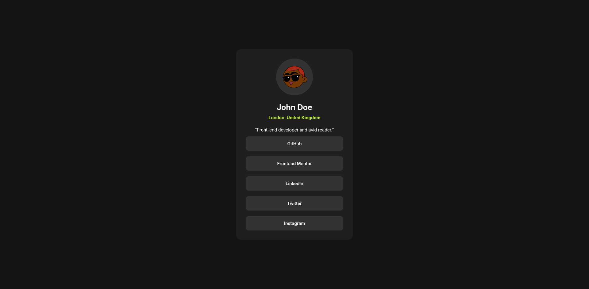

## Links

* [Project GitHub](https://github.com/gabrielh-muniz/profile-links/tree/main)
* [Avatars for profiles](https://www.dicebear.com/)
* [Learn CSS Flexbox in 20 minutes (course)](https://www.youtube.com/watch?v=wsTv9y931o8&t=1101s)

## Description

Responsive card that users are able to see, hover and focus states for all interactive elements on the page.

## Screenshot

